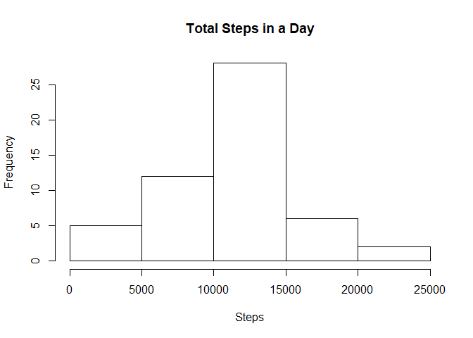
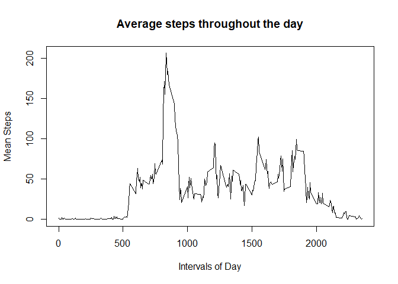
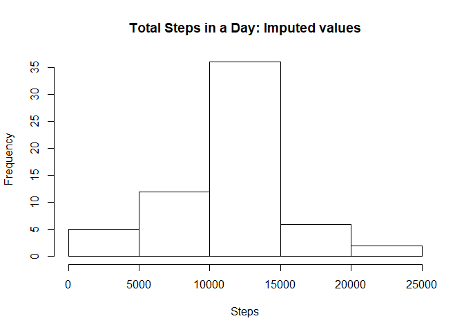
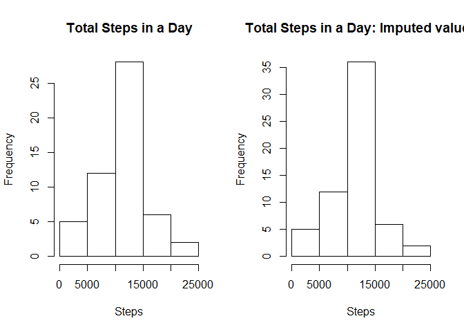
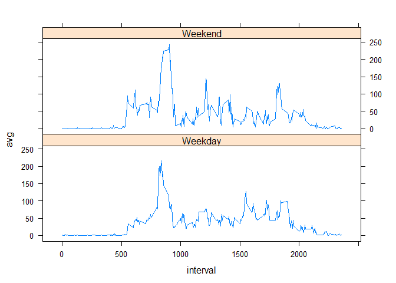

## Introduction
We are going to be using a data set from personal movement monitors. We are focusing on the amount of steps taking during different time intervals in the day.

## Read in the Data
We read in the data using read.csv - the data is available [here](https://d396qusza40orc.cloudfront.net/repdata%2Fdata%2Factivity.zip). There are three variables:  
  1. Steps - Number of steps taken during interval (missing values as "NA")
  2. Date - Date in YYYY-MM-DD 
  3. Interval - 5 minute intervals of the day  


```r
steps <- read.csv(unzip("activity.zip"))
```
The resulting data frame is 17568 observations of 3 variables.

We are going to load and use the dplyr package.

```r
library(dplyr)
library(lattice)
stepsT <- as_tibble(steps)
```

## What is mean total number of steps taken per day?
1. Make a histogram of the total number of steps taken each day  

```r
total_steps <- summarise(group_by(stepsT, date), total = sum(steps))
```
Then plot  

```r
hist(total_steps$total, xlab = "Steps", main = "Total Steps in a Day")
```

<!-- -->

2. Calculate and report the mean and median total number of steps taken per day  

```r
mean_day <- mean(total_steps$total, na.rm = TRUE)
median_day <- median(total_steps$total, na.rm = TRUE)
print(c("mean-", mean_day))
```

```
## [1] "mean-"            "10766.1886792453"
```

```r
print(c("median-", median_day))
```

```
## [1] "median-" "10765"
```
## What is the average daily activity pattern?
1. Make a time series plot (i.e. type = "l") of the 5-minute interval (x-axis)  
and the average number of steps taken, averaged across all days (y-axis)  

```r
avg_int <- summarise(group_by(stepsT, interval), avg = mean(steps, na.rm = TRUE))
```
Now make the time series graph using the base plotting system  

```r
plot(avg_int$interval, y = avg_int$avg, type = "l", 
     xlab = "Intervals of Day", ylab = "Mean Steps", 
     main = "Average steps throughout the day")
```

<!-- -->
2. Which 5-minute interval, on average across all the days in the dataset,  
contains the maximum number of steps?  
Find the maximum value

```r
max_steps <- max(avg_int$avg)
```
Now pull the interval that has the maximum value

```r
max_int <- avg_int[avg_int$avg == max_steps, 1]
max_int
```

```
## # A tibble: 1 x 1
##   interval
##      <int>
## 1      835
```
## Imputing missing values
1. Calculate and report the total number of missing values in the dataset (i.e. the total  
number of rows with NAs)
We are going to use the complete.cases function to do this. It returns a logical vector  
which we can then use sum on.

```r
has_nas <- !complete.cases(stepsT)
sum(has_nas)
```

```
## [1] 2304
```

2. Devise a strategy for filling in all of the missing values in the dataset. The strategy  
does not need to be sophisticated. For example, you could use the mean/median for that day, 
or the mean for that 5-minute interval, etc.  

We are going to replace NAs with  the average steps for that interval. These values  
have already been calculated and stored in avg_int.

3. Create a new dataset that is equal to the original dataset but with the missing data
filled in.
We are going to first make a copy of stepsT, the data in a tibble format to work with.

```r
stepsI <- stepsT
```
Then we are going to replace entries that are Na with the avg from that time interval.

```r
imp <- function(index){
  current <- stepsI$steps[index]
  if(is.na(current) == FALSE){
      return(current)
  }
  else if(is.na(current) == TRUE){
      int <- stepsI$interval[index]
      replace <- avg_int[avg_int$interval == int, ]
      replace <- replace$avg
      return(replace)
  }    
}
lst <- 1:nrow(stepsI)
imputed <- sapply(lst, imp)
stepsI$imputed <- imputed
```
4. Make a histogram of the total number of steps taken each day and


Calculate the total number of steps per day again with the imputed values:

```r
total_stepsI <- summarise(group_by(stepsI, date), total = sum(imputed))
```
Now plot:

```r
hist(total_stepsI$total, xlab = "Steps", main = "Total Steps in a Day: Imputed values")
```

<!-- -->

Calculate and report the mean and median total number of steps taken
per day. 

```r
mean_day_I <- mean(total_stepsI$total, na.rm = TRUE)
median_day_I <- median(total_stepsI$total, na.rm = TRUE)
print(c("mean-", mean_day_I))
```

```
## [1] "mean-"            "10766.1886792453"
```

```r
print(c("median-", median_day_I))
```

```
## [1] "median-"          "10766.1886792453"
```
Do these values differ from theestimates from the first part of the assignment? 
There is little difference.
What is the impact of imputing missing data on the estimates of the total daily number of steps?

```r
par(mfrow = c(1, 2))
hist(total_steps$total, xlab = "Steps", main = "Total Steps in a Day")
hist(total_stepsI$total, xlab = "Steps", main = "Total Steps in a Day: Imputed values")
```

<!-- -->

##Are there differences in activity patterns between weekdays and weekends?
For this part the weekdays() function may be of some help here. Use the  
dataset with the filled-in missing values for this part.

1. Create a new factor variable in the dataset with two levels --  
"weekday" and "weekend" indicating whether a given date is a weekday or weekend day.  
Our filled-in dataset is in tibble format so we will use the sapply() function to
introduce a new column variable to the data. To use the weekdays() function we will also
need to put the date variable into a dates format. I defined a new function wk() to seperate whether the dates are weekdays or on the weekend

```r
stepsI$date <- as.Date(as.character(stepsI$date), "%Y-%M-%d")
wk <- function(dt){
  wkdy <- weekdays(dt)
  itis <- wkdy %in% c("Monday", "Tuesday", "Wednesday", "Thursday", "Friday")
  if(itis == TRUE){
      return(as.factor("Weekday"))
  } else{
      return(as.factor("Weekend"))
  }
}
stepsI$Weekpart <- sapply(stepsI$date, wk)
```
2. Make a panel plot containing a time series plot (i.e. type = "l") of the 5-minute  
interval (x-axis) and the average number of steps taken, averaged across all weekday  
days or weekend days (y-axis). 
We will group by Weekpart and by interval then calculate the average number of steps using summarize()

```r
avg_int_wk <- summarise(group_by(stepsI, Weekpart, interval), avg = mean(imputed, na.rm = TRUE))
```
Now we will plot using the lattice system:

```r
xyplot(avg~interval|Weekpart, data = avg_int_wk, type = "l", layout = c(1, 2))
```

<!-- -->
